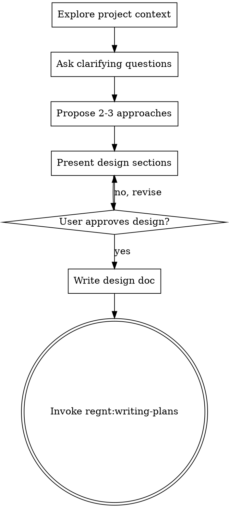

# Brainstorming Ideas Into Designs

## Overview

Help turn ideas into fully formed designs and specs through natural collaborative dialogue.

Start by understanding the current project context (codebase + SoloBoard), then ask questions one at a time to refine the idea. Once you understand what you're building, present the design and get user approval.

<HARD-GATE>
Do NOT invoke any implementation skill, write any code, scaffold any project, or take any implementation action until you have presented a design and the user has approved it. This applies to EVERY project regardless of perceived simplicity.
</HARD-GATE>

## Anti-Pattern: "This Is Too Simple To Need A Design"

Every project goes through this process. A CRUD, a single action, a config change — all of them. "Simple" projects are where unexamined assumptions cause the most wasted work. The design can be short (a few sentences for truly simple projects), but you MUST present it and get approval.

## Checklist

You MUST create a task for each of these items and complete them in order:

1. **Explore project context** — check codebase, SoloBoard docs/features, recent commits
2. **Ask clarifying questions** — one at a time, understand purpose/constraints/success criteria
3. **Propose 2-3 approaches** — with trade-offs and your recommendation
4. **Present design** — in sections scaled to their complexity, get user approval after each section
5. **Write design doc** — save to `docs/plans/YYYY-MM-DD-<topic>-design.md` and commit
6. **Transition to implementation** — invoke `regnt:writing-plans` skill to create implementation plan

## Process Flow

**The terminal state is invoking regnt:writing-plans.** Do NOT invoke any implementation skill. The ONLY skill you invoke after brainstorming is writing-plans.

## The Process

**Understanding the idea:**
- Check SoloBoard context first: `get-project-context` for docs, features, active tasks
- Check codebase: files, patterns, recent commits
- Ask questions one at a time to refine the idea
- Prefer multiple choice questions when possible
- Only one question per message
- Focus on understanding: purpose, constraints, success criteria
- Consider Laravel stack: Livewire 4, Flux UI, Alpine.js, Tailwind CSS

**Exploring approaches:**
- Propose 2-3 different approaches with trade-offs
- Present options conversationally with your recommendation and reasoning
- Lead with your recommended option and explain why
- Consider: existing Laravel patterns, SoloBoard integration, available agents

**Presenting the design:**
- Once you believe you understand what you're building, present the design
- Scale each section to its complexity
- Ask after each section whether it looks right so far
- Cover: architecture, models/migrations, components, data flow, error handling, testing
- Consider Laravel implementation order: Migration+Model → Policy → Action → Livewire → UI → Tests

## After the Design

**Documentation:**
- Write the validated design to `docs/plans/YYYY-MM-DD-<topic>-design.md`
- Commit the design document to git
- Optionally save as SoloBoard document: `create-document project_slug={slug} title="Design: {topic}"`

**Implementation:**
- Invoke the `regnt:writing-plans` skill to create a detailed implementation plan
- Do NOT invoke any other skill. writing-plans is the next step.

## Key Principles

- **One question at a time** - Don't overwhelm with multiple questions
- **Multiple choice preferred** - Easier to answer than open-ended when possible
- **YAGNI ruthlessly** - Remove unnecessary features from all designs
- **Explore alternatives** - Always propose 2-3 approaches before settling
- **Incremental validation** - Present design, get approval before moving on
- **Laravel-first** - Always consider existing Laravel patterns and conventions
- **SoloBoard context** - Use project context to inform design decisions
