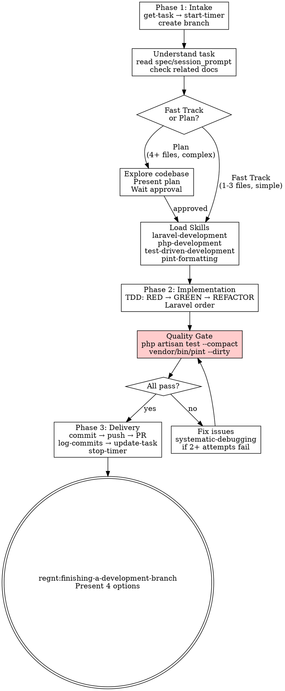

# Development Workflow

Workflow de 3 fases para implementar uma task unica do SoloBoard com disciplina TDD e verificacao rigorosa.

**Core principle:** TDD always. Verify before claiming. One task, done right.

## The Iron Law

```
NO TASK IS DONE WITHOUT FRESH VERIFICATION EVIDENCE
```

If you haven't run `php artisan test --compact` AND `vendor/bin/pint --dirty` and shown their output, you CANNOT mark the task as done. No exceptions.

## Process Flow



## Regras

- **NUNCA** pular testes — TDD e obrigatorio (RED-GREEN-REFACTOR)
- **NUNCA** declarar "done" sem evidencia — rodar os comandos, mostrar output
- **SEMPRE** iniciar timer antes de codar
- **SEMPRE** registrar commits via `log-commits`
- Commits em ingles, UI em portugues
- Se a task tem `spec` ou `session_prompt`: ler como User Story
- Se a task tem `session_result`: ler como trabalho anterior ja feito

---

## Phase 1: Intake

**Announce:** "I'm using the dev-workflow skill to implement this task."

Executar imediatamente ao receber `task_id`:

```
get-task task_id={ID}
start-timer task_id={ID}
update-task task_id={ID} status=doing
```

```bash
git checkout main && git pull
git checkout -b feature/{slug-descritivo}
```

Depois:
1. Confirmar compreensao da task (titulo, descricao, spec, session_prompt)
2. Se houver documentos relacionados: `list-documents` → `get-document`
3. Se spec nao estiver clara, perguntar antes de prosseguir

### Decisao: Fast Track ou Plano?

| Criterio | Fast Track | Plano |
|----------|------------|-------|
| Complexidade | Baixa (bug fix, ajuste UI, CRUD simples) | Alta (nova feature, refactor, integracao) |
| Arquivos | 1-3 arquivos | 4+ arquivos |
| Duvidas | Nenhuma | Precisa explorar codebase |

**Fast Track**: Carregar skills e ir para Phase 2 direto.

**Plano**: Explorar codebase e apresentar plano resumido ao usuario:

```markdown
## Plano: {titulo}

**Arquivos a modificar:**
- {path}: {o que fazer}

**Ordem de execucao (Laravel order):**
1. Migration + Model
2. Policy (se necessario)
3. Action
4. Livewire
5. UI

**Testes necessarios:**
- {teste}
```

Apos aprovacao: `add-to-plan task_id={ID} description="Resumo"`

---

## Phase 2: Implementacao

### Load Skills (MANDATORY)

Antes de qualquer implementacao:

```
/regnt:laravel-development
/regnt:php-development
/regnt:test-driven-development
/regnt:pint-formatting
```

### TDD: RED-GREEN-REFACTOR

Para CADA funcionalidade:

1. **RED** — Escrever teste falhando (Pest PHP)
   ```bash
   php artisan test --filter="test name" --compact
   # Confirmar: FAIL (pelo motivo esperado)
   ```

2. **GREEN** — Escrever codigo minimo para passar
   ```bash
   php artisan test --filter="test name" --compact
   # Confirmar: PASS
   ```

3. **REFACTOR** — Limpar, manter testes green
   ```bash
   php artisan test --compact
   vendor/bin/pint --dirty
   ```

4. **COMMIT** — `feat: [description]`

<HARD-GATE>
NO production code without a failing test first.
Write code before test? Delete it. Start over with the test.
</HARD-GATE>

### Laravel Implementation Order

Seguir SEMPRE esta ordem:

1. **Migration + Model** — casts, relationships, scopes → delegate to `regnt:laravel-core` agent
2. **Policy** — authorization (se necessario) → delegate to `regnt:laravel-core` agent
3. **Action** — logica de negocio isolada → use `regnt:php-development` skill
4. **Livewire** — componentes reativos SFC → delegate to `regnt:frontend-laravel` agent
5. **UI** — views com Flux → delegate to `regnt:frontend-laravel` agent
6. **Tests** — feature/unit com Pest → delegate to `regnt:pest-tester` agent

Commits incrementais a cada camada relevante.

### Agents e Skills Disponiveis

| Agent | Quando usar |
|-------|-------------|
| `regnt:laravel-core` | Models, Migrations, Factories, Enums, DTOs, Policies, Form Requests |
| `regnt:frontend-laravel` | Livewire 4, Flux UI, Blade, Alpine.js |
| `regnt:pest-tester` | Feature tests, unit tests, Livewire tests |
| `regnt:ai-workflows` | Laravel AI SDK, MCP integration |
| `laravel-simplifier` | Revisar e simplificar codigo antes de entregar |

### When Things Go Wrong

Se testes falham apos implementacao:
- **1-2 tentativas**: Fix e re-run
- **3+ tentativas**: **STOP** — Use `regnt:systematic-debugging`
  1. Read error messages carefully
  2. Reproduce with `--filter`
  3. Find root cause BEFORE fixing
  4. Fix ONE thing at a time

---

## Phase 3: Entrega

### Quality Gate (MANDATORY)

```bash
php artisan test --compact    # ALL tests passing
vendor/bin/pint --dirty       # ALL code formatted
```

<HARD-GATE>
Do NOT proceed to delivery if quality checks fail.
Do NOT claim "done" without showing the output of BOTH commands.
Evidence before claims, always.
</HARD-GATE>

### Verification Checklist

Before marking task as done:

- [ ] Wrote failing tests BEFORE implementation (TDD RED)
- [ ] `php artisan test --compact` — **show output: 0 failures**
- [ ] `vendor/bin/pint --dirty` — **show output: 0 changes**
- [ ] N+1 queries resolvidos (eager loading)
- [ ] Validacao: Livewire rules + DB constraints
- [ ] Error handling: flash messages + wire:loading
- [ ] Policies aplicadas onde necessario

Can't check all boxes? Task is NOT done. Fix first.

### Finalizar

```bash
git add -A && git commit -m "feat: description-in-english"
git push -u origin HEAD
```

```
log-commits task_id={ID} commits=[hash1,hash2] pr_url={URL_if_any}
update-task task_id={ID} status=done session_result="What was implemented"
stop-timer task_id={ID} notes="Summary of work"
```

### Finishing Branch

**REQUIRED SUB-SKILL:** Use `regnt:finishing-a-development-branch` to present options:
1. Merge local
2. Push + PR
3. Keep branch
4. Discard

---

## Red Flags — STOP

| Thought | Reality |
|---------|---------|
| "Skip the test, it's a small change" | TDD is non-negotiable. Test first. |
| "Tests should pass now" | "Should" ≠ evidence. Run them. Show output. |
| "I'll write tests after implementing" | Tests-after prove nothing. Test first. |
| "Quick fix, no need to investigate" | Use systematic-debugging after 2+ failures. |
| "Task is basically done" | "Basically" ≠ verified. Run quality gate. |
| "Timer overhead slows me down" | Timer tracks real effort. Start it. |
| "Fast Track means skip TDD" | Fast Track skips planning, NOT discipline. |

## Common Rationalizations

| Excuse | Reality |
|--------|---------|
| "Too simple for TDD" | Simple code breaks. Test takes 30 seconds. |
| "Just a UI change, no test needed" | Livewire tests exist for a reason. Test it. |
| "Pint is cosmetic" | Pint is part of quality gate. Both or neither. |
| "I already know the root cause" | Knowing symptoms ≠ knowing root cause. Investigate. |
| "I'll update SoloBoard later" | Update now. Timer + status are part of delivery. |

---

## Integration

**Skills loaded every task:**
- **regnt:laravel-development** — Laravel 12 conventions
- **regnt:php-development** — PHP 8.x patterns
- **regnt:test-driven-development** — TDD discipline
- **regnt:pint-formatting** — Code formatting

**Discipline skills (always active):**
- **regnt:verification-before-completion** — Evidence before claims
- **regnt:systematic-debugging** — Root cause before fixes (when tests fail)

**Completes with:**
- **regnt:finishing-a-development-branch** — Merge/PR/Keep/Discard options

---

## Referencia: Tools MCP

<details>
<summary>Expandir lista de tools</summary>

| Tool | Uso |
|------|-----|
| `get-task` | Obter detalhes da task |
| `update-task` | Atualizar status/session_result |
| `start-timer` | Iniciar timer |
| `stop-timer` | Parar timer com notas |
| `log-commits` | Registrar commits e PR |
| `add-to-plan` | Adicionar ao plano do dia |
| `list-documents` | Listar docs do projeto |
| `get-document` | Ler documento |

</details>
