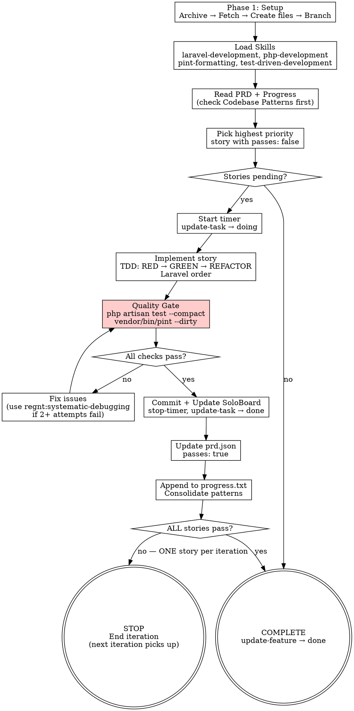

# Ralph Loop

Loop autonomo de desenvolvimento que implementa user stories de uma Feature do SoloBoard, uma por vez, com disciplina TDD e verificacao rigorosa.

**Core principle:** ONE story per iteration. TDD always. Verify before claiming. Never skip quality gates.

## The Iron Law

```
NO STORY IS COMPLETE WITHOUT FRESH VERIFICATION EVIDENCE
```

If you haven't run `php artisan test --compact` AND `vendor/bin/pint --dirty` in this iteration, you CANNOT mark the story as passing. No exceptions.

## When to Use

**Always:**
- Implementing a SoloBoard Feature with multiple tasks/stories
- User mentions "ralph", "loop autonomo", "implementar feature"
- Feature has 2+ user stories that need sequential implementation

**Never:**
- Single task → use `regnt:dev-workflow` instead
- No SoloBoard feature → use `regnt:executing-plans` instead

## Comando

```
/ralph <feature_id> [--max-iterations=10] [--run]
```

- `feature_id`: ID da feature no SoloBoard (obrigatorio)
- `--max-iterations`: Maximo de iteracoes (default: 10)
- `--run`: Iniciar o loop imediatamente apos setup

## Process Flow



---

## Phase 1: Setup

**Announce:** "I'm using the ralph-loop skill to set up autonomous feature implementation."

### 1.1 Arquivar sessao anterior (se existir)

Se existirem arquivos em `storage/ralph/` (prd.json, CLAUDE.md, progress.txt), mover para archive:

```bash
ARCHIVE_DIR="storage/ralph/archive/$(date +%Y%m%d_%H%M%S)"
mkdir -p "$ARCHIVE_DIR"
mv storage/ralph/prd.json "$ARCHIVE_DIR/" 2>/dev/null || true
mv storage/ralph/CLAUDE.md "$ARCHIVE_DIR/" 2>/dev/null || true
mv storage/ralph/progress.txt "$ARCHIVE_DIR/" 2>/dev/null || true
```

### 1.2 Buscar dados da Feature

```
ralph-export feature_id={ID} max_iterations={N}
get-feature feature_id={ID}
```

O `ralph-export` retorna o PRD JSON. O `get-feature` retorna detalhes da feature (titulo, projeto, tasks).

### 1.3 Criar estrutura local

Criar os arquivos em `storage/ralph/`:

**storage/ralph/prd.json** (output do ralph-export):
```json
{
  "project": "Feature Title",
  "branchName": "ralph/feature-slug",
  "description": "Feature spec",
  "maxIterations": 10,
  "userStories": [
    {
      "id": "US-123",
      "title": "Task title",
      "description": "Task description or session_prompt",
      "acceptanceCriteria": ["Criteria 1", "Criteria 2"],
      "priority": 1,
      "passes": false,
      "metadata": {
        "soloboard_task_id": 123,
        "soloboard_status": "todo"
      }
    }
  ]
}
```

**storage/ralph/CLAUDE.md** (usar template abaixo):

```markdown
# Ralph Loop — {featureTitle}

> Project: {projectName}
> Auto-generated by /ralph skill.

You are an autonomous coding agent working on a software project.

## Load Required Skills (MANDATORY FIRST STEP)

Before ANY implementation, load these skills by invoking:

```
/regnt:laravel-development
/regnt:php-development
/regnt:test-driven-development
/regnt:pint-formatting
```

**IMPORTANT**: Load at the START of each iteration. No exceptions.

## Discipline Skills (ALWAYS ACTIVE)

These discipline rules apply to EVERY action you take:

- **regnt:test-driven-development** — NO production code without a failing test first
- **regnt:verification-before-completion** — NO completion claims without fresh evidence
- **regnt:systematic-debugging** — NO fixes without root cause investigation first

## Your Task

### Initial Check (once per session)

1. Check feature status: `get-feature` with `feature_id` from prd.json
2. If feature status is NOT `doing`, update: `update-feature` with `status=doing`

### Per User Story

1. Read the PRD at `storage/ralph/prd.json`
2. Read `storage/ralph/progress.txt` (check **Codebase Patterns** section FIRST)
3. Pick the **highest priority** user story where `passes: false`
4. Start timer: `start-timer` with `task_id` from `metadata.soloboard_task_id`
5. Update status: `update-task` with `task_id` and `status=doing`
6. **Implement using TDD (RED-GREEN-REFACTOR):**
   For each piece of functionality:
   a. Write failing test (Pest PHP) — verify it FAILS
   b. Write minimal code to pass — verify it PASSES
   c. Refactor — verify still PASSES
   d. Commit: `feat: [Story ID] - [description]`
7. Follow **Laravel implementation order**:
   1. **Migration + Model** — casts, relationships, scopes → `regnt:laravel-core` agent
   2. **Policy** — authorization (if needed) → `regnt:laravel-core` agent
   3. **Action** — business logic → `regnt:php-development` skill
   4. **Livewire** — reactive components → `regnt:frontend-laravel` agent
   5. **UI** — views with Flux → `regnt:frontend-laravel` agent
   6. **Tests** — feature/unit → `regnt:pest-tester` agent
8. **Quality Gate (MANDATORY):**
   ```bash
   php artisan test --compact    # ALL tests must pass
   vendor/bin/pint --dirty       # ALL code must be formatted
   ```
   <HARD-GATE>
   Do NOT proceed if quality checks fail. Fix issues first.
   If 3+ fix attempts fail → use regnt:systematic-debugging
   </HARD-GATE>
9. **Verify before claiming complete:**
   - Did I RUN `php artisan test --compact`? What was the output?
   - Did I RUN `vendor/bin/pint --dirty`? What was the output?
   - Can I show EVIDENCE of both passing?
   - If NO to any → run them NOW before proceeding
10. Commit final if uncommitted changes: `feat: [Story ID] - [Story Title]`
11. Update SoloBoard:
    - `update-task` with `task_id`, `status=done`, `session_result` describing implementation
    - `stop-timer` with `task_id` and `notes` summarizing work
12. Update `storage/ralph/prd.json` → set `passes: true`
13. Append progress to `storage/ralph/progress.txt`
14. **If LAST story** (all `passes: true`):
    - `update-feature` with `feature_id` → `status=done`

## Agents and Skills

### Agents (delegate when appropriate)

| Agent | When |
|-------|------|
| `regnt:laravel-core` | Models, Migrations, Factories, Enums, DTOs, Policies |
| `regnt:frontend-laravel` | Livewire 4, Flux UI, Blade, Alpine.js |
| `regnt:pest-tester` | Feature tests, unit tests, Livewire tests |
| `regnt:ai-workflows` | Laravel AI SDK, MCP integration |
| `laravel-simplifier` | Simplify and review code before delivery |

### Skills

| Skill | When |
|-------|------|
| `/regnt:laravel-development` | Laravel 12 conventions |
| `/regnt:php-development` | PHP 8.x patterns |
| `/regnt:test-driven-development` | TDD discipline — RED-GREEN-REFACTOR |
| `/regnt:pint-formatting` | Code formatting |
| `/regnt:systematic-debugging` | When tests fail after 2+ attempts |
| `/regnt:verification-before-completion` | Before ANY completion claim |
| `/regnt:boost-tools` | Debug, DB, Artisan, docs |

## Progress Report Format

APPEND to storage/ralph/progress.txt (never replace):

```
## [Date/Time] - [Story ID]
- What was implemented
- Files changed
- Tests: [count] passing
- **Learnings for future iterations:**
  - Patterns discovered
  - Gotchas encountered
  - Useful context
---
```

## Consolidate Patterns

If you discover a **reusable pattern**, add to `## Codebase Patterns` at TOP of progress.txt.

## Quality Requirements

- ALL commits must pass quality checks (test + lint)
- Do NOT commit broken code
- Follow TDD: test FIRST, then implement
- Follow existing code patterns
- Use conventional commits: `feat:`, `fix:`, `test:`, `chore:`, `refactor:`

## Stop Condition

After completing a user story, check if ALL stories have `passes: true`.

If ALL complete:
1. `update-feature` with `feature_id` → `status=done`
2. Reply with: <promise>COMPLETE</promise>

**If stories remain with `passes: false`, end your response normally.**
Another iteration picks up the next story.

## Red Flags — STOP

- Implementing without writing test first → STOP, write test
- Claiming story passes without running `php artisan test` → STOP, run it
- Fixing test failures without investigating root cause → STOP, use systematic-debugging
- Implementing multiple stories in one iteration → STOP, one at a time
- Skipping quality gate because "it should work" → STOP, run the commands

## Important

- **ONE story per iteration — then STOP**
- **TDD always — test first, then code**
- **Verify always — evidence before claims**
- Commit frequently
- Keep CI green
- If story blocked → add `blockedReason` to prd.json, skip to next

## User Stories

{taskList}

## SoloBoard MCP Reference

| Tool | Purpose |
|------|---------|
| `get-feature` | Get feature details and current status |
| `update-feature` | Update feature status (`doing`, `done`) |
| `start-timer` | Start timer for a task |
| `stop-timer` | Stop timer with optional `notes` |
| `update-task` | Update task `status`, `session_result` |
| `timer-status` | Check if a timer is running |
| `get-task` | Get full task details |
```

**storage/ralph/progress.txt** (vazio inicialmente)

**scripts/ralph.sh** (se nao existir):

```bash
#!/usr/bin/env bash
# Ralph Loop — SoloBoard Integration
# Usage: ./scripts/ralph.sh [--tool claude|codex] [max_iterations]

set -euo pipefail

SCRIPT_DIR="$(cd "$(dirname "${BASH_SOURCE[0]}")" && pwd)"
PROJECT_DIR="$(dirname "$SCRIPT_DIR")"
RALPH_DIR="${PROJECT_DIR}/storage/ralph"

TOOL="claude"
MAX_ITERATIONS=10

prd_read() {
    php -r "\$d=json_decode(file_get_contents('${RALPH_DIR}/prd.json'),true);echo $1;"
}

while [[ $# -gt 0 ]]; do
    case $1 in
        --tool)
            TOOL="$2"
            shift 2
            ;;
        --help|-h)
            echo "Usage: $0 [--tool claude|codex] [max_iterations]"
            exit 0
            ;;
        *)
            MAX_ITERATIONS="$1"
            shift
            ;;
    esac
done

if [[ ! -f "${RALPH_DIR}/prd.json" ]]; then
    echo "Error: ${RALPH_DIR}/prd.json not found."
    echo "Run: /ralph <feature_id> to setup"
    exit 1
fi

if [[ -s "${RALPH_DIR}/progress.txt" ]]; then
    ARCHIVE_DIR="${RALPH_DIR}/archive/$(date +%Y%m%d_%H%M%S)"
    mkdir -p "$ARCHIVE_DIR"
    cp "${RALPH_DIR}/progress.txt" "$ARCHIVE_DIR/"
    cp "${RALPH_DIR}/prd.json" "$ARCHIVE_DIR/"
    echo "Archived previous run to ${ARCHIVE_DIR}"
    : > "${RALPH_DIR}/progress.txt"
fi

echo "=== Ralph Loop ==="
echo "Project: $(prd_read "\$d['project']")"
echo "Stories: $(prd_read "count(\$d['userStories'])")"
echo "Pending: $(prd_read "count(array_filter(\$d['userStories'],fn(\$s)=>!\$s['passes']))")"
echo "Max iterations: ${MAX_ITERATIONS}"
echo "Tool: ${TOOL}"
echo "=================="

cd "$PROJECT_DIR"

for i in $(seq 1 "$MAX_ITERATIONS"); do
    PENDING=$(prd_read "count(array_filter(\$d['userStories'],fn(\$s)=>!\$s['passes']))")
    if [[ "$PENDING" -eq 0 ]]; then
        echo "=== All stories pass! Loop complete. ==="
        exit 0
    fi

    echo "--- Iteration ${i}/${MAX_ITERATIONS} (${PENDING} stories remaining) ---"

    if [[ "$TOOL" == "claude" ]]; then
        OUTPUT=$(claude --dangerously-skip-permissions --print < "${RALPH_DIR}/CLAUDE.md" 2>&1) || true
    elif [[ "$TOOL" == "codex" ]]; then
        OUTPUT=$(codex --approval-mode full-auto --input-file "${RALPH_DIR}/CLAUDE.md" 2>&1) || true
    else
        echo "Error: Unknown tool '${TOOL}'"
        exit 1
    fi

    echo "$OUTPUT"

    if echo "$OUTPUT" | grep -q "<promise>COMPLETE</promise>"; then
        echo "=== COMPLETE signal received. Loop finished. ==="
        exit 0
    fi

    [[ "$i" -lt "$MAX_ITERATIONS" ]] && sleep 2
done

echo "=== Max iterations (${MAX_ITERATIONS}) reached. ==="
exit 1
```

### 1.4 Criar branch

```bash
git checkout main && git pull
git checkout -b ralph/{feature-slug}
```

### 1.5 Confirmar setup

Mostrar ao usuario:
- Feature: {titulo}
- Projeto: {nome}
- Stories: {quantidade} ({pendentes} pendentes)
- Branch: ralph/{slug}
- Arquivos criados em storage/ralph/

---

## Phase 2: Execute Loop

Se `--run` foi passado ou usuario confirmar, executar.

### Via Script (modo headless)

```bash
./scripts/ralph.sh --tool claude {max_iterations}
```

### Via Claude Code (modo direto — recomendado)

1. Ler `storage/ralph/prd.json`
2. Encontrar primeira story com `passes: false`
3. Se nenhuma: COMPLETE
4. Executar workflow da story (TDD + Laravel order + quality gate + SoloBoard update)
5. Atualizar prd.json com `passes: true`
6. **STOP** — uma story por iteracao

---

## Red Flags — STOP and Return to Process

If you catch yourself thinking:

| Thought | Reality |
|---------|---------|
| "Skip the test, it's obvious" | TDD is non-negotiable. Write the test first. |
| "Tests should pass" | "Should" ≠ evidence. Run them. |
| "I'll write tests after" | Tests-after prove nothing. Delete code, start with test. |
| "Just implement two stories, they're related" | ONE story per iteration. No exceptions. |
| "Quality gate passed last time" | Fresh verification every iteration. |
| "This fix is quick, no need to investigate" | Use systematic-debugging after 2+ failures. |
| "I'll update SoloBoard later" | Update immediately. Timer + status are part of the process. |
| "The story is basically done" | "Basically" ≠ "verified". Run quality gate. |

**ALL of these mean: STOP. Follow the process.**

## Common Rationalizations

| Excuse | Reality |
|--------|---------|
| "Story too simple for TDD" | Simple code breaks. Test takes 30 seconds. |
| "Multiple stories are tiny, combine them" | One story per iteration keeps context clean. |
| "Tests pass, skip Pint" | Pint is part of quality gate. Both or neither. |
| "Timer overhead slows me down" | Timer tracks real effort. Start it. |
| "Progress.txt is bureaucracy" | Future iterations depend on your learnings. Write them. |

## Verification Checklist

Before marking ANY story as `passes: true`:

- [ ] Wrote failing tests BEFORE implementation (TDD RED)
- [ ] Watched tests fail for expected reason
- [ ] Implemented minimal code to pass (TDD GREEN)
- [ ] Ran `php artisan test --compact` — **show output with 0 failures**
- [ ] Ran `vendor/bin/pint --dirty` — **show output with 0 changes**
- [ ] Committed with conventional commit
- [ ] Updated SoloBoard: `update-task` + `stop-timer`
- [ ] Updated prd.json: `passes: true`
- [ ] Appended to progress.txt with learnings

Can't check all boxes? Story is NOT complete. Do NOT mark as passing.

---

## Exemplos de Uso

### Setup basico
```
/ralph 42
```
Cria arquivos em storage/ralph/ para feature #42.

### Setup e executar
```
/ralph 42 --run
```
Cria arquivos e inicia o loop autonomo.

### Customizar iteracoes
```
/ralph 42 --max-iterations=20
```

### Continuar loop existente
```
./scripts/ralph.sh 15
```

---

## Integration

**Required skills (loaded every iteration):**
- **regnt:laravel-development** — Laravel 12 conventions
- **regnt:php-development** — PHP 8.x patterns
- **regnt:test-driven-development** — TDD discipline (RED-GREEN-REFACTOR)
- **regnt:pint-formatting** — Code formatting

**Discipline skills (always active):**
- **regnt:verification-before-completion** — Evidence before claims
- **regnt:systematic-debugging** — Root cause before fixes

**Optional skills:**
- **regnt:boost-tools** — Debug, DB, Artisan
- **regnt:requesting-code-review** — Review after story (optional)

**Completes with:**
- **regnt:finishing-a-development-branch** — After all stories pass

---

## Troubleshooting

### Feature nao encontrada
```
list-features project_slug={slug}
```

### MCP nao conectado
```bash
claude mcp add --transport http soloboard https://regnt.sophostech.com.br/mcp
```

### Testes falhando repetidamente
Use `regnt:systematic-debugging`:
1. Read error messages carefully
2. Reproduce with `--filter`
3. Find root cause
4. Fix ONE thing at a time

### Story bloqueada
O loop adiciona `blockedReason` no prd.json e pula para a proxima.

---

## Referencia: Tools MCP

| Tool | Uso |
|------|-----|
| `ralph-export` | Exportar feature como PRD |
| `get-feature` | Detalhes da feature |
| `update-feature` | Atualizar status (doing/done) |
| `list-features` | Listar features disponiveis |
| `start-timer` | Iniciar timer para task |
| `stop-timer` | Parar timer com notas |
| `update-task` | Atualizar status/session_result |
| `get-task` | Detalhes da task |
