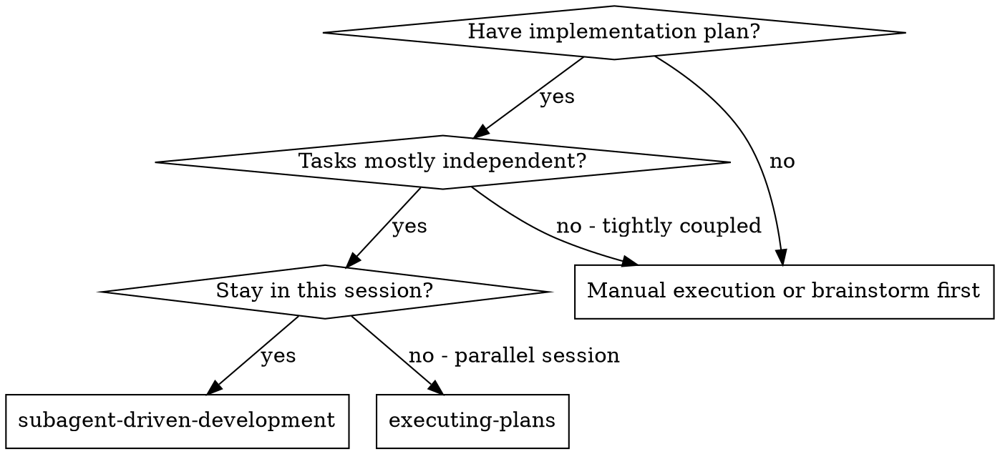

# Subagent-Driven Development

Execute plan by dispatching fresh subagent per task, with two-stage review after each: spec compliance review first, then code quality review.

**Core principle:** Fresh subagent per task + two-stage review (spec then quality) = high quality, fast iteration

## When to Use



## The Process

### Per Task:

1. **Dispatch implementer subagent** (use `./implementer-prompt.md` template)
   - Provide FULL task text — don't make subagent read plan file
   - Include Laravel implementation order context
   - Specify which agent type to use (laravel-core, frontend-laravel, pest-tester)
2. **Answer questions** if subagent asks before starting
3. **Implementer implements, tests, commits, self-reviews**
4. **Dispatch spec reviewer subagent** (use `./spec-reviewer-prompt.md`)
   - If spec issues: implementer fixes, re-review (loop)
5. **Dispatch code quality reviewer subagent** (use `./code-quality-reviewer-prompt.md`)
   - If quality issues: implementer fixes, re-review (loop)
6. **Run quality gate:**
   ```bash
   php artisan test --compact
   vendor/bin/pint --dirty
   ```
7. **Mark task complete**
8. **Update SoloBoard** (if task tracked):
   ```
   update-task task_id={ID} status=done session_result="What was implemented"
   stop-timer task_id={ID} notes="Summary"
   ```

### After All Tasks:

1. Dispatch final code-reviewer subagent for entire implementation
2. **REQUIRED SUB-SKILL:** Use `regnt:finishing-a-development-branch`

## Agent Selection for Implementer

| Task Type | Agent Type | Skills to Load |
|-----------|-----------|----------------|
| Migration, Model, Enum, DTO, Policy | `regnt:laravel-core` | `regnt:laravel-development` |
| Livewire components, Flux UI, Blade | `regnt:frontend-laravel` | `regnt:laravel-development` |
| Feature/Unit tests | `regnt:pest-tester` | `regnt:test-driven-development` |
| AI SDK, MCP integration | `regnt:ai-workflows` | `regnt:laravel-development` |
| General PHP logic, Actions | general-purpose | `regnt:php-development` |

## Example Workflow

```
You: I'm using Subagent-Driven Development to execute this plan.

[Read plan file once: docs/plans/feature-plan.md]
[Extract all 5 tasks with full text and context]
[Create TodoWrite with all tasks]
[Start SoloBoard timer if tracked: start-timer task_id={ID}]

Task 1: Create Widget model and migration

[Dispatch regnt:laravel-core subagent with full task text]

Implementer: "Before I begin — should Widget use soft deletes?"

You: "No, hard deletes are fine."

Implementer:
  - Created migration + model with casts and relationships
  - Added factory and seeder
  - Tests: 3/3 passing
  - Self-review: All good
  - Committed: "feat: add Widget model and migration"

[Dispatch spec reviewer]
Spec reviewer: ✅ Spec compliant — all requirements met

[Dispatch code quality reviewer]
Code reviewer: ✅ Approved — clean implementation

[php artisan test --compact → PASS]
[vendor/bin/pint --dirty → clean]
[Mark Task 1 complete]

Task 2: Create Widget Livewire component

[Dispatch regnt:frontend-laravel subagent]
...
```

## Red Flags

**Never:**
- Start implementation on main/master branch without explicit user consent
- Skip reviews (spec compliance OR code quality)
- Proceed with unfixed issues
- Dispatch multiple implementation subagents in parallel (conflicts)
- Make subagent read plan file (provide full text instead)
- Skip quality gate between tasks (`php artisan test`, `vendor/bin/pint`)
- Accept "close enough" on spec compliance
- **Start code quality review before spec compliance is ✅** (wrong order)
- Move to next task while either review has open issues

**If subagent asks questions:**
- Answer clearly and completely
- Provide additional context if needed

**If reviewer finds issues:**
- Implementer (same subagent) fixes them
- Reviewer reviews again
- Repeat until approved

## Integration

**Required workflow skills:**
- **regnt:using-git-worktrees** - Set up isolated workspace before starting
- **regnt:writing-plans** - Creates the plan this skill executes
- **regnt:requesting-code-review** - Code review template for reviewer subagents
- **regnt:finishing-a-development-branch** - Complete development after all tasks

**Subagents should use:**
- **regnt:test-driven-development** - Subagents follow TDD for each task
- **regnt:laravel-development** - Laravel 12 conventions
- **regnt:php-development** - PHP 8.x patterns
