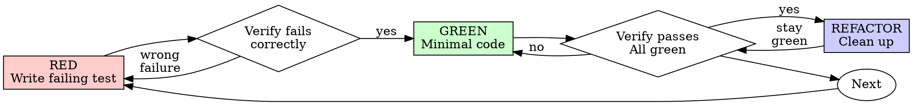

# Test-Driven Development (TDD)

## Overview

Write the test first. Watch it fail. Write minimal code to pass.

**Core principle:** If you didn't watch the test fail, you don't know if it tests the right thing.

**Violating the letter of the rules is violating the spirit of the rules.**

## When to Use

**Always:**
- New features
- Bug fixes
- Refactoring
- Behavior changes

**Exceptions (ask your human partner):**
- Throwaway prototypes
- Generated code
- Configuration files

Thinking "skip TDD just this once"? Stop. That's rationalization.

## The Iron Law

```
NO PRODUCTION CODE WITHOUT A FAILING TEST FIRST
```

Write code before the test? Delete it. Start over.

**No exceptions:**
- Don't keep it as "reference"
- Don't "adapt" it while writing tests
- Don't look at it
- Delete means delete

Implement fresh from tests. Period.

## Red-Green-Refactor



### RED - Write Failing Test

Write one minimal test showing what should happen. Use Pest PHP.

<Good>
```php
it('retries failed operations 3 times', function () {
    $attempts = 0;
    $operation = function () use (&$attempts) {
        $attempts++;
        if ($attempts < 3) {
            throw new RuntimeException('fail');
        }
        return 'success';
    };

    $result = retry(3, $operation);

    expect($result)->toBe('success');
    expect($attempts)->toBe(3);
});
```
Clear name, tests real behavior, one thing
</Good>

<Bad>
```php
it('retry works', function () {
    $mock = Mockery::mock(Service::class);
    $mock->shouldReceive('call')
        ->times(3)
        ->andReturnUsing(fn () => throw new Exception(), fn () => throw new Exception(), fn () => 'ok');

    expect($mock->call())->toBe('ok');
});
```
Vague name, tests mock not code
</Bad>

**Requirements:**
- One behavior per test
- Clear descriptive name with `it()`
- Real code (no mocks unless unavoidable)
- Use `expect()` over `assert*()`

### Verify RED - Watch It Fail

**MANDATORY. Never skip.**

```bash
php artisan test --filter="retries failed operations" --compact
```

Confirm:
- Test fails (not errors)
- Failure message is expected
- Fails because feature missing (not typos)

**Test passes?** You're testing existing behavior. Fix test.

**Test errors?** Fix error, re-run until it fails correctly.

### GREEN - Minimal Code

Write simplest code to pass the test.

<Good>
```php
function retry(int $times, callable $callback): mixed
{
    for ($i = 0; $i < $times; $i++) {
        try {
            return $callback();
        } catch (Throwable $e) {
            if ($i === $times - 1) {
                throw $e;
            }
        }
    }
}
```
Just enough to pass
</Good>

<Bad>
```php
function retry(
    int $times,
    callable $callback,
    int $sleepMs = 0,
    string $backoff = 'linear',
    ?callable $onRetry = null,
): mixed {
    // YAGNI
}
```
Over-engineered
</Bad>

Don't add features, refactor other code, or "improve" beyond the test.

### Verify GREEN - Watch It Pass

**MANDATORY.**

```bash
php artisan test --filter="retries failed operations" --compact
```

Confirm:
- Test passes
- Other tests still pass
- Output pristine (no errors, warnings)

**Test fails?** Fix code, not test.

**Other tests fail?** Fix now.

### REFACTOR - Clean Up

After green only:
- Remove duplication
- Improve names
- Extract to Actions or concerns
- Run Pint: `vendor/bin/pint --dirty`

Keep tests green. Don't add behavior.

### Repeat

Next failing test for next feature.

## Laravel-Specific TDD Patterns

### Feature Test (HTTP)

```php
it('creates a widget for authenticated user', function () {
    $user = User::factory()->create();

    $this->actingAs($user)
        ->post('/widgets', ['name' => 'Test', 'type' => 'basic'])
        ->assertRedirect('/widgets');

    expect(Widget::count())->toBe(1);
    expect(Widget::first())
        ->name->toBe('Test')
        ->type->toBe('basic')
        ->user_id->toBe($user->id);
});
```

### Livewire Test

```php
it('validates widget name is required', function () {
    $user = User::factory()->create();

    Livewire::actingAs($user)
        ->test(CreateWidget::class)
        ->set('name', '')
        ->call('save')
        ->assertHasErrors(['name' => 'required']);
});
```

### Action Test

```php
it('calculates total with discount', function () {
    $order = Order::factory()->create(['subtotal' => 10000]);
    $discount = Discount::factory()->create(['percentage' => 10]);

    $result = app(CalculateOrderTotalAction::class)->execute($order, $discount);

    expect($result)->toBe(9000);
});
```

### Policy Test

```php
it('allows owner to update widget', function () {
    $user = User::factory()->create();
    $widget = Widget::factory()->for($user)->create();

    expect($user->can('update', $widget))->toBeTrue();
});

it('denies non-owner from updating widget', function () {
    $user = User::factory()->create();
    $widget = Widget::factory()->create(); // different owner

    expect($user->can('update', $widget))->toBeFalse();
});
```

## Good Tests

| Quality | Good | Bad |
|---------|------|-----|
| **Minimal** | One thing. "and" in name? Split it. | `it('validates email and domain and whitespace')` |
| **Clear** | Name describes behavior | `it('test1')` |
| **Pest conventions** | `it()` + `expect()` | `$this->assertTrue()` |
| **Factories** | `User::factory()->create()` | Manual model creation |
| **Specific assertions** | `assertSuccessful()` | `assertStatus(200)` |

## Common Rationalizations

| Excuse | Reality |
|--------|---------|
| "Too simple to test" | Simple code breaks. Test takes 30 seconds. |
| "I'll test after" | Tests passing immediately prove nothing. |
| "Already manually tested" | Ad-hoc ≠ systematic. No record, can't re-run. |
| "Deleting X hours is wasteful" | Sunk cost fallacy. Keeping unverified code is technical debt. |
| "Need to explore first" | Fine. Throw away exploration, start with TDD. |
| "Test hard = design unclear" | Listen to test. Hard to test = hard to use. |
| "TDD will slow me down" | TDD faster than debugging. Pragmatic = test-first. |

## Red Flags - STOP and Start Over

- Code before test
- Test after implementation
- Test passes immediately
- Can't explain why test failed
- Rationalizing "just this once"
- "Keep as reference" or "adapt existing code"

**All of these mean: Delete code. Start over with TDD.**

## Verification Checklist

Before marking work complete:

- [ ] Every new function/method has a test
- [ ] Watched each test fail before implementing
- [ ] Each test failed for expected reason (feature missing, not typo)
- [ ] Wrote minimal code to pass each test
- [ ] All tests pass: `php artisan test --compact`
- [ ] Code formatted: `vendor/bin/pint --dirty`
- [ ] Tests use Pest conventions (`it()`, `expect()`)
- [ ] Factories for test data
- [ ] Edge cases and errors covered

Can't check all boxes? You skipped TDD. Start over.

## Debugging Integration

Bug found? Write failing test reproducing it. Follow TDD cycle. Test proves fix and prevents regression.

Never fix bugs without a test.

## Final Rule

```
Production code → test exists and failed first
Otherwise → not TDD
```

No exceptions without your human partner's permission.
